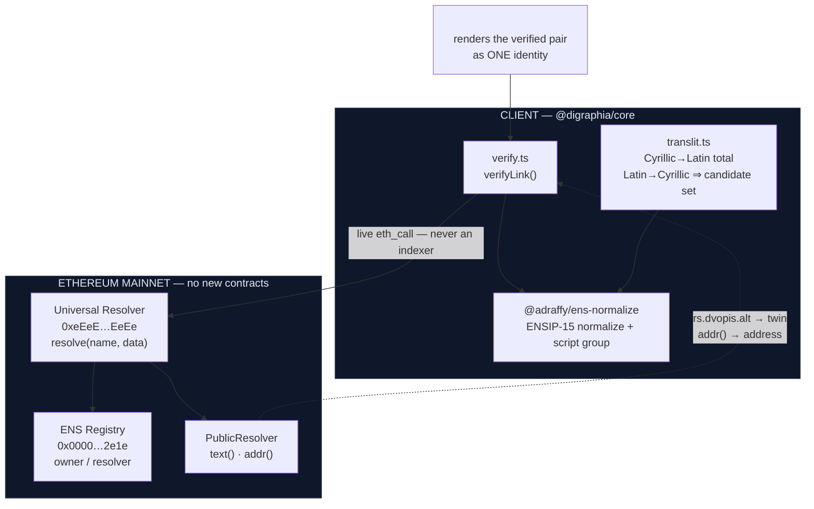
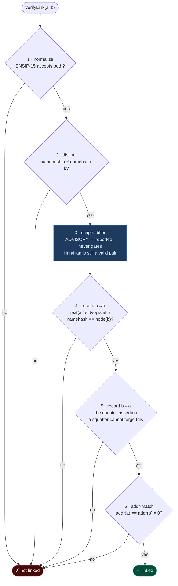

# digraphia

**Cross-script identity linking for ENS.**

`никола.eth` and `nikola.eth` are the same person. ENS has no way to know that.
This is a client library and a proposed text-record convention that lets a name
holder *assert* the link, bidirectionally, so that any client can verify it
without trusting an issuer, an oracle, or a registry contract.

Built at ETHBelgrade 2026. Belgrade is the right place for it: Serbian is one of
the few languages written natively in two alphabets at once.

---

## 1. The problem

### 1.1 ENS identity is keyed by hash, and the hash is script-blind

An ENS name resolves through a `namehash` — a recursive keccak over the
normalized labels. Two strings that a human reads as the same name produce two
completely unrelated 32-byte keys:

```
никола.eth   →  0x5ead07d5c07e46e232c2bcdb51572c3adab96b1b78adc178ea2e72fd10147bff
nikola.eth   →  0xd5819418a57415869202273f3367a2ee0afb3fbc7e7021e211ff2c6242e2dea0
```

Nothing in the protocol relates them. They are two registrations, two owners,
two resolvers, two profiles, two sets of records. To ENS they are as unrelated
as `nikola.eth` and `vitalik.eth`.

For a monoscriptal language that is a non-issue. For a **digraphic** one it
splits every user's identity in half.

### 1.2 Serbia actually is digraphic

Serbian is written in **both** Cyrillic and Latin, officially and
simultaneously. Both alphabets are taught in school. Street signs, newspapers,
government forms and shop fronts mix them freely. A Serb does not "have a
Cyrillic name and a Latin name" — they have *one* name that is spelled two ways,
and which spelling appears is a matter of context, keyboard, or typography.

So a Serbian user of ENS faces a choice no English speaker does: register
`никола.eth`, or `nikola.eth`, or pay twice and maintain two disconnected
identities that no client will ever display as one.

### 1.3 This is not a homograph attack, and that distinction is the whole point

There is a well-known and superficially similar problem: **homograph spoofing**,
where `аpple.eth` (Cyrillic а) impersonates `apple.eth` (Latin a).

**ENS already solved that.** [ENSIP-15](https://docs.ens.domains/ensip/15/)
normalization rejects whole-script confusables and forbids mixed-script labels
outright. Verified against the reference implementation:

```
а.eth        FAIL  whole-script confusable: Cyrillic/Latin
дигpафиja    FAIL  illegal mixture: Cyrillic + Latin "p"
```

Digraphia is the **inverse** problem, and it is *created by that correct design*.
Because ENSIP-15 refuses to mix scripts inside one label, a digraphic user is
forced into two separate, valid, unmixed labels — and then given no way to say
they belong together. Closing the spoofing hole opened the identity gap.

The security goal is therefore reversed. Anti-spoofing asks *"are these
confusingly similar? then reject."* Digraphia asks *"are these genuinely the
same person? then prove it."*

### 1.4 The link cannot be computed — this is the load-bearing fact

The obvious objection is: why store anything on-chain? Serbian Latin↔Cyrillic is
famously a clean 1:1 mapping. Just transliterate.

**Cyrillic → Latin is a total function. Latin → Cyrillic is not.**

Three Cyrillic letters — `љ` `њ` `џ` — are written in Latin as *two-character
digraphs* `lj` `nj` `dž`. But those same two-character sequences also occur as
two genuinely separate letters across a morpheme boundary. Nothing in the string
distinguishes the cases:

| Latin | Cyrillic | `nj` / `dž` is… |
|---|---|---|
| `konj` | `коњ` | **one** letter — `њ` |
| `injekcija` | `инјекција` | **two** letters — `н` + `ј` (prefix boundary) |
| `džep` | `џеп` | **one** letter — `џ` |
| `nadživeti` | `надживети` | **two** letters — `д` + `ж` (prefix boundary) |

All four are valid ENS labels. Deciding which reading is correct requires
knowing the *morphology* of the word — which for a personal name means knowing
the person. A client cannot do it, and a contract certainly cannot.

> **Therefore the link is not derivable. It must be declared by whoever holds
> both names, and verified — not computed — by everyone else.**

That single fact is the justification for the entire protocol. This library's
API reflects it: `latinToCyrillicCandidates()` returns *every* reading rather
than guessing one.

```
ђорђе  →  djordje  →  [ ђорђе, ђордје, дјорђе, дјордје ]
```

---

## 2. This is not a Serbian problem

Serbian is the sharpest case, not the only one. Every result below was probed
against the ENSIP-15 reference implementation (`@adraffy/ens-normalize`); the
bracketed value is the script group ENS assigns.

### 2.1 Cyrillic ↔ Latin, beyond Serbian

Twelve languages, both sides valid ENS labels today:

| Language | Cyrillic | Latin | Situation |
|---|---|---|---|
| **Serbian** | `никола` `[Cyrillic]` | `nikola` `[ASCII]` | Both official, simultaneous |
| **Montenegrin** | `ђевојка` `[Cyrillic]` | `djevojka` `[ASCII]` | Both official |
| **Macedonian** | `скопје` `[Cyrillic]` | `skopje` `[ASCII]` | Cyrillic official, Latin ubiquitous online |
| **Bulgarian** | `софия` `[Cyrillic]` | `sofia` `[ASCII]` | Official romanization by law (2009) |
| **Uzbek** | `тошкент` `[Cyrillic]` | `toshkent` `[ASCII]` | **Both official, active transition** |
| **Kazakh** | `қазақстан` `[Cyrillic]` | `qazaqstan` `[ASCII]` | **State transition to Latin by 2031** |
| **Ukrainian** | `київ` `[Cyrillic]` | `kyiv` `[ASCII]` | Official romanization standard |
| **Russian** | `москва` `[Cyrillic]` | `moskva` `[ASCII]` | Universal informal romanization |
| **Belarusian** | `мінск` `[Cyrillic]` | `minsk` `[ASCII]` | Łacinka has official status |
| **Tajik** | `душанбе` `[Cyrillic]` | `dushanbe` `[ASCII]` | Persian in Cyrillic |
| **Kyrgyz** | `бишкек` `[Cyrillic]` | `bishkek` `[ASCII]` | Latin adoption debated |
| **Mongolian** | `улаанбаатар` `[Cyrillic]` | `ulaanbaatar` `[ASCII]` | Also traditional `ᠮᠣᠩᠭᠣᠯ` `[Restricted[Mong]]` |

**Kazakhstan is the largest live case.** The state is migrating a 20M-person
population from Cyrillic to Latin on a published timeline. Every Kazakh
institution will spend the next several years holding *both* spellings of every
name. All of it normalizes in ENS today:

```
қазақстан [Cyrillic]  <->  qazaqstan [ASCII]
әлем      [Cyrillic]  <->  älem      [Latin]
өзен      [Cyrillic]  <->  özen      [Latin]
шымкент   [Cyrillic]  <->  şymkent   [Latin]
```

### 2.2 The problem is script-variance, not Cyrillic

The same structure appears wherever one language has two written forms:

| Pair | Example | ENS groups | Population |
|---|---|---|---|
| **Chinese** Traditional / Simplified | `台灣` / `台湾` | `Han` / `Han` | ~1.3B |
| **Japanese** kanji / kana | `東京` / `とうきょう` | `Han` / `Japanese` | ~125M |
| **Korean** hangul / hanja | `서울` / `首爾` | `Korean` / `Han` | ~80M |
| **Punjabi** Gurmukhi / Shahmukhi | `ਪੰਜਾਬੀ` / `پنجابی` | `Gurmukhi` / `Arabic` | ~150M |
| **Hindi / Urdu** | `हिन्दी` / `اردو` | `Devanagari` / `Arabic` | ~600M |
| **Greek** / romanized | `αθήνα` / `athina` | `Greek` / `ASCII` | ~13M |
| **Armenian** / romanized | `երևան` / `yerevan` | `Armenian` / `ASCII` | ~7M |
| **Georgian** / romanized | `თბილისი` / `tbilisi` | `Georgian` / `ASCII` | ~4M |

Chinese Traditional/Simplified alone is a larger affected population than every
Cyrillic-writing country combined.

### 2.3 A finding that shaped the design: ENS script groups are coarser than writing systems

`台灣` and `台湾` are **distinct nodes but the same ENSIP-15 group** (`Han`).
Japanese hiragana and katakana are likewise both `Japanese`:

```
台灣     [Han]      vs  台湾     [Han]       sameGroup=true   distinctNode=true
とうきょう [Japanese] vs  トウキョウ [Japanese]  sameGroup=true   distinctNode=true
```

An early version of this library **required** the two names to be in different
script groups. That check would have rejected the two largest script-variant
populations on earth. It is now **advisory**: reported to the user, never
enforced. The real security property is *distinct nodes plus mutual assertion*;
the script difference is descriptive colour.

### 2.4 A second finding: some scripts are second-class in ENS

ENSIP-15 disallows characters that are **mandatory letters** in living
orthographies. The name is simply unregisterable:

| Character | Codepoint | Required by | Consequence |
|---|---|---|---|
| `đ` | U+0111 | Serbian, Croatian, Montenegrin | `đorđe.eth` **impossible**; `ђорђе.eth` fine |
| `ı` | U+0131 | Turkish, Azerbaijani, Kazakh Latin | `bakı.eth`, `ışık.eth` **impossible** |
| `ʻ` | U+02BB | **Official Uzbek Latin** (`oʻ`, `gʻ`) | `oʻzbekiston.eth` **impossible** |
| `dž` | U+01C6 | precomposed Serbian digraph | must decompose to `dž` |

This produces a genuine asymmetry: **for some names, only the Cyrillic spelling
can exist in ENS at all.** Uzbekistan's official Latin orthography cannot be
written as an ENS label.

The workaround is the conventional ASCII fallback (`đ`→`dj`, `dž`→`dž`), which
this library emits automatically via `cyrillicToLatin(name, 'ens-safe')`. But
the fallback introduces *more* ambiguity — `dj` is now either `ђ` or `д`+`ј` —
which reinforces §1.4: the link must be asserted, never inferred.

---

## 3. The solution

### 3.1 Design constraints

Three constraints ruled out the obvious designs:

1. **No new trust.** A registry contract, an attestation issuer, or an oracle
   would all mean "this link is true because someone said so." Rejected.
2. **No on-chain string handling.** ENSIP-15 normalization cannot run on the
   EVM — it needs Unicode tables, NFC, emoji sequences and confusables data. A
   contract can therefore *never* validate a name string. Any on-chain component
   must accept precomputed namehashes, which makes a client library the natural
   home.
3. **No new contracts at all, if possible.** Achieved: the protocol is two
   existing `setText` calls plus client-side verification.

### 3.2 The assertion

Each name stores a text record naming its twin. Two writes, perfectly symmetric:

```solidity
setText(namehash("никола.eth"), "rs.dvopis.alt", "nikola.eth")
setText(namehash("nikola.eth"), "rs.dvopis.alt", "никола.eth")
```

Both names must additionally resolve to the **same address** via `addr()`.

**Why the key is namespaced.** [ENSIP-5](https://docs.ens.domains/ensip/5/)
reserves bare lowercase keys (`avatar`, `url`, `email`) for spec-defined globals
and requires application-specific keys to use reverse-dot namespacing with at
least one dot. `rs.dvopis.alt` complies (`dvopis` = Serbian for *digraphia*).
The unprefixed global `alt-script` is what the accompanying ENSIP *proposes* —
shipping namespaced until a spec exists is correct behaviour, not a workaround.

### 3.3 Why bidirectionality is the security property

A one-directional record proves **nothing**. Anyone may point a text record at
any name; a squatter can register `никола.eth` and point it at your `nikola.eth`
this afternoon.

What a squatter *cannot* do is make **your** name point back. The
counter-assertion requires control of the other name's resolver. Only someone
holding both can produce both halves.

```
никола.eth ──asserts──▶ nikola.eth        ✗ proves nothing (anyone can claim)
никола.eth ◀──asserts── nikola.eth        ✗ proves nothing (anyone can claim)
никола.eth ◀─asserts──▶ nikola.eth        ✓ requires control of BOTH
   └────── same addr() ──────┘            ✓ and a single controlling identity
```

No issuer. No oracle. No registry. No new contract. The security derives
entirely from who is able to write which resolver record.

### 3.4 Architecture



### 3.5 The verification algorithm

`verifyLink(client, nameA, nameB)` runs six checks and returns each with a
human-readable statement of what was proven, so a UI can render a chain of
evidence instead of a boolean.



Two rules the implementation is strict about:

**Compare by namehash, never by string.** A raw string comparison is defeated by
an unnormalized or differently-cased variant that hashes to the same node.
`НИКОЛА.eth` and `никола.eth` are the same node and must both be accepted; the
test suite asserts this.

**Read live, never from an indexer.** Every read is an `eth_call` through the
Universal Resolver. Indexed data (a subgraph, Etherscan) is push-based and can
be stale — and a squatter can set a record thirty seconds before a check.
Security-relevant reads must be pull-based.

---

## 4. Repository overview

```
hackathon-ethbg26/
├── README.md                      this document
├── HANDOFF.md                     project background, research log, decisions
├── ens-field-manual.html          standalone ENS architecture reference
│
└── packages/
    └── digraphia/                 @digraphia/core — the library
        ├── src/
        │   ├── index.ts           public exports
        │   ├── translit.ts        Serbian transliteration, ENS-constrained
        │   └── verify.ts          verifyLink() + LINK_KEY
        └── test/
            ├── translit.test.ts   13 tests
            ├── verify.test.ts     13 tests
            └── live.mjs           smoke test against real mainnet
```

### `src/translit.ts`

| Export | Purpose |
|---|---|
| `cyrillicToLatin(s, style)` | Total function. `'canonical'` emits real orthography (`đorđe`); `'ens-safe'` emits only ENS-legal characters (`djordje`). Always use `ens-safe` for labels. |
| `latinToCyrillicCandidates(s, max?)` | Returns **every** valid reading. Each `nj`/`lj`/`dž`/`dj` doubles the set. Result count bounded against adversarial input. |
| `isAmbiguousLatin(s)` | Whether more than one reading exists — drives the "this cannot be derived" explanation in the UI. |
| `ENS_DISALLOWED_LATIN` | The `đ`→`dj`, `dž`→`dž` substitution table from §2.4. |

### `src/verify.ts`

| Export | Purpose |
|---|---|
| `verifyLink(client, a, b, opts?)` | The six-check verification of §3.5. Returns `{ linked, checks[], a, b }`. |
| `LINK_KEY` | `rs.dvopis.alt` — the ENSIP-5-compliant text record key. |
| `Check` | `{ id, ok, severity: 'required' \| 'advisory', detail }`. `linked` is true iff every **required** check passes. |
| `NameFacts` | Per-name evidence: normalized form, node, script group, raw record, address. |

### Test coverage

26 tests, all passing. The security-relevant ones:

- a squatter pointing at a name that does not point back is **rejected**
- a mutually-asserting pair with **different** `addr()` is rejected
- `НИКОЛА.eth` is accepted as the same node as `никола.eth` (namehash, not string)
- a record containing a non-name string is rejected
- a name cannot link to itself
- Chinese `台灣`/`台湾` and Japanese kana pairs **link successfully** despite sharing a script group
- a same-group pair still fails if the counter-assertion is missing

```bash
pnpm install
pnpm --filter @digraphia/core test
```

---

## 5. Status

**Verified against mainnet.** Live run through a real Universal Resolver
`eth_call`, before the demo records were written:

```
PASS  normalize        Both normalize under ENSIP-15: никола.leonh.eth / nikola.leonh.eth
PASS  distinct         Distinct namehashes.
PASS  scripts-differ   Different ENSIP-15 script groups: Cyrillic vs ASCII.
FAIL  record-a-to-b    никола.leonh.eth has no rs.dvopis.alt record.
FAIL  record-b-to-a    nikola.leonh.eth has no rs.dvopis.alt record — counter-assertion missing.
FAIL  addr-match       At least one name has no address set.
```

The three failures are correct: those records do not exist yet.

| | |
|---|---|
| ✅ | Core library, 26 tests, live-verified read path |
| ⬜ | Demo subnames under `leonh.eth` + record writes |
| ⬜ | `<LinkedIdentity>` UI |
| ⬜ | ENSIP draft for the global `alt-script` key |

---

## 6. Proposed ENSIP — `alt-script`

The library ships under `rs.dvopis.alt` per ENSIP-5. The accompanying draft
proposes a **global** key:

> **`alt-script`** — a name asserting that another ENS name is the same identity
> written in a different script. A client MUST treat the assertion as valid only
> when the named counterpart asserts the same in reverse (compared by namehash)
> and both names resolve to an identical nonzero address. A one-directional
> assertion carries no meaning.

Deliberately **not** specified: which scripts, which transliteration standard,
or any orthographic rules. §1.4 and §2.3 show why — transliteration is
non-invertible and ENS's own script groups do not align with writing systems.
The record asserts *sameness of identity*, and the mechanism that makes it
trustworthy is mutuality, not linguistics.

---

## 7. References

- [ENSIP-5 — text records](https://docs.ens.domains/ensip/5/) · key namespacing
- [ENSIP-15 — name normalization](https://docs.ens.domains/ensip/15/) · script groups, confusables
- [ENSIP-10 — wildcard resolution](https://docs.ens.domains/ensip/10/)
- [ENS protocol docs](https://docs.ens.domains/learn/protocol/) · [deployments](https://docs.ens.domains/learn/deployments)
- [`@adraffy/ens-normalize`](https://github.com/adraffy/ens-normalize.js) · ENSIP-15 reference implementation
