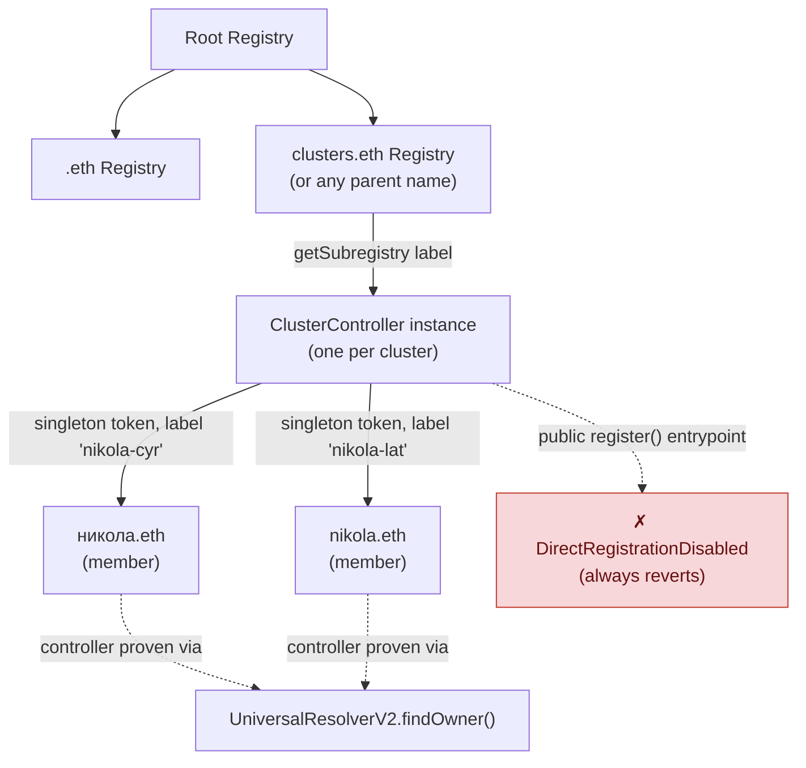
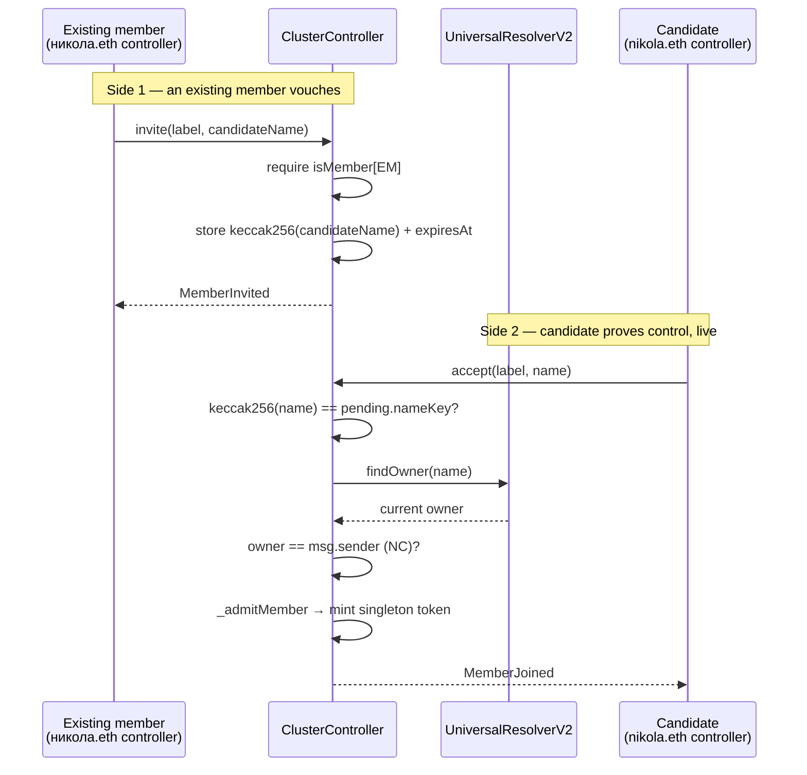
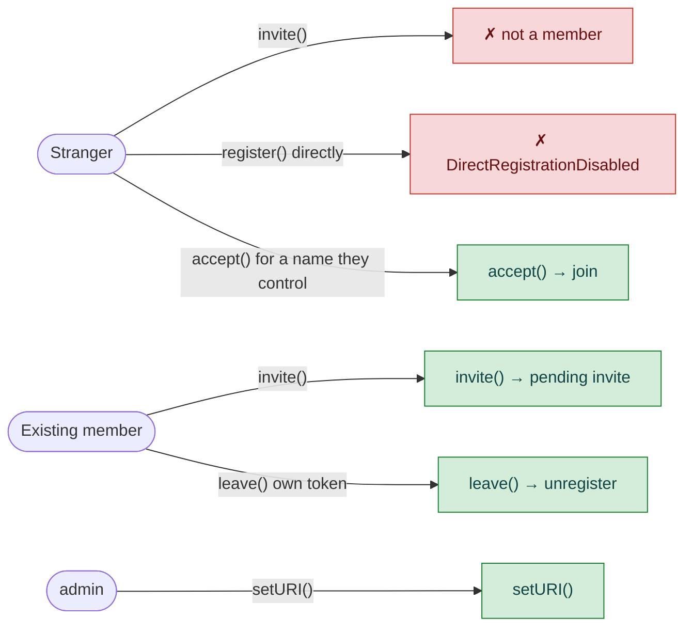

# Cluster registry design (non-normative)

> **Status:** design sketch, not part of any proposed ENSIP. It was originally Appendix A of
> [`ensip-draft-alt-script.md`](./ensip-draft-alt-script.md) and was moved here so the ENSIP stays
> small and reviewable on its own. The ENSIP defines a list-valued text record that already
> supports N-way clusters; this document describes an optional registry-based alternative for
> large or frequently changing clusters, built on the ENSv2 registry model (Sepolia beta at the
> time of writing, so details may change).
>
> Reference sketch: [`contracts/ClusterController.sol`](./contracts/ClusterController.sol) —
> untested against the current `contracts-v2` beta. Fuller design-space comparison:
> [`ensv2-engineering-options.md`](./ensv2-engineering-options.md).

## 1. Why a registry, not a bigger text record

The ENSIP's list-valued text record already supports clusters of any size, so this design is not
needed for correctness. It addresses cost: with a text record, adding or removing a member means
updating every member's record (O(n) writes), every read is an O(n) live check with an O(n²)
pairwise comparison in the worst case, and a member whose list has silently gone stale breaks the
whole cluster with nothing on-chain to signal it. A structure purpose-built for group membership
avoids all three. ENSv2's registry tree already _is_
that structure: every registry is a singleton-ownership token collection (`ERC1155Singleton` —
exactly one owner per token ID) with membership changes indexable for free via
`LabelRegistered`/`TransferSingle`/`LabelUnregistered` events, which is a guarantee the text-record
form cannot make (the ENSIP's Security Considerations require live reads, not indexed data,
precisely because `text()` values fall outside ENSv2's offchain-indexing invariant). A cluster is
therefore represented as one small `PermissionedRegistry` subclass — `ClusterController` — where
each member holds one token in it.

## 2. System design

Membership is not a new storage shape — it's an ordinary ENSv2 registry token, addressable the same
way any subname is (`<clusterId>.clusters.eth`), enumerable with the same tooling, and reusing the
`Entry` struct and `ERC1155Singleton` machinery `PermissionedRegistry` already provides.

## 3. User flow: invite → accept (the bidirectional join)

The ENSIP's security property — one-sided assertion proves nothing, only mutual assertion
does — is preserved by requiring two independent, live-checked calls: an existing member vouches
for a candidate, and the candidate separately proves control of their own name.

Both checks are live at the moment they run — `accept()` never trusts an address `invite()`
supplied earlier, so a name that changes hands between the two calls is judged by its _current_
controller, not a stale snapshot (see `ensv2-engineering-options.md` §1's `resource`-not-`tokenId`
anchoring lesson, applied here to ownership rather than to registry state).

## 4. Permissions

| Actor                       | Action                            | Gate                                                                                                       |
| --------------------------- | --------------------------------- | ---------------------------------------------------------------------------------------------------------- |
| Founding member             | deploy + auto-join                | constructor requires `findOwner(founderName) == msg.sender`                                                |
| Existing member             | `invite(label, candidateName)`    | `isMember[msg.sender]`                                                                                     |
| Any name controller         | `accept(label, name)`             | invite exists for `label`, not expired, `keccak256(name)` matches, **and** `findOwner(name) == msg.sender` |
| Member (own token only)     | `leave(anyId)`                    | inherited `ROLE_UNREGISTER`, granted _only_ to that member's own token at `accept()` time                  |
| `admin` (constructor param) | `setURI(...)` (inherited)         | `ROLE_SET_URI` — cosmetic/metadata only, no membership authority                                           |
| Anyone                      | `register(...)` (base entrypoint) | always reverts — the only mint path is `invite`+`accept`                                                   |

## 5. Deliberately unresolved (see contract header for full rationale)

- No multi-member removal ("vote to kick") — only self-service `leave()` exists today.
- No enforcement that a name belongs to at most one cluster.
- No on-chain check that members are actually script-variants of one another — that judgment stays
  off-chain, e.g. via `packages/digraphia/src/verify.ts`, same as the text-record form in the ENSIP.

