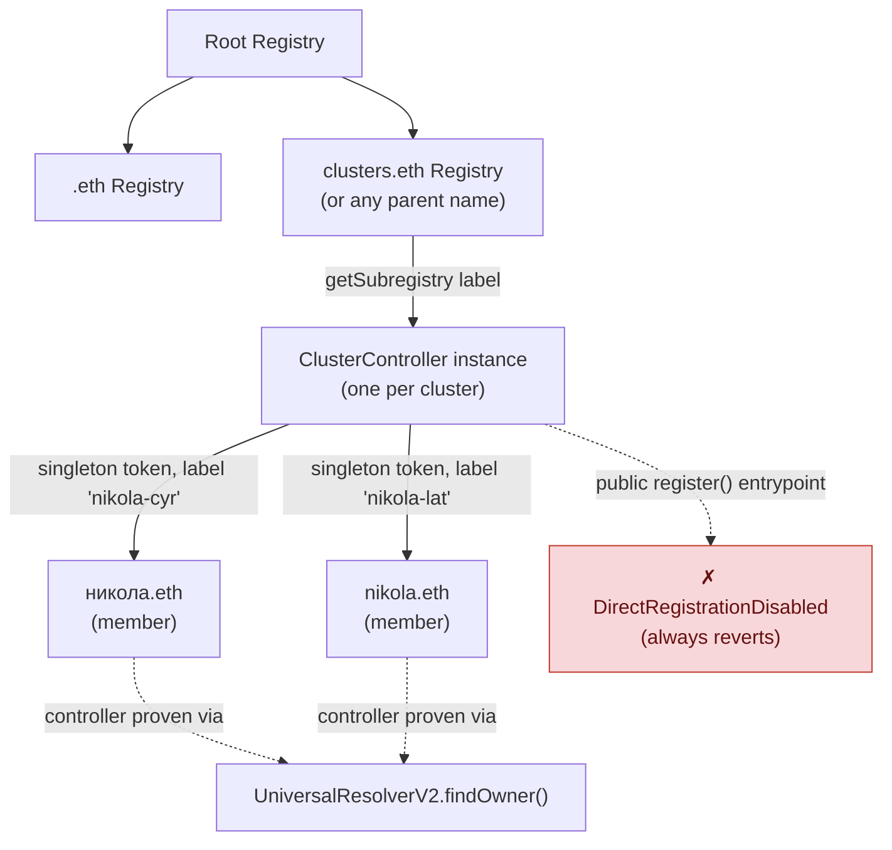
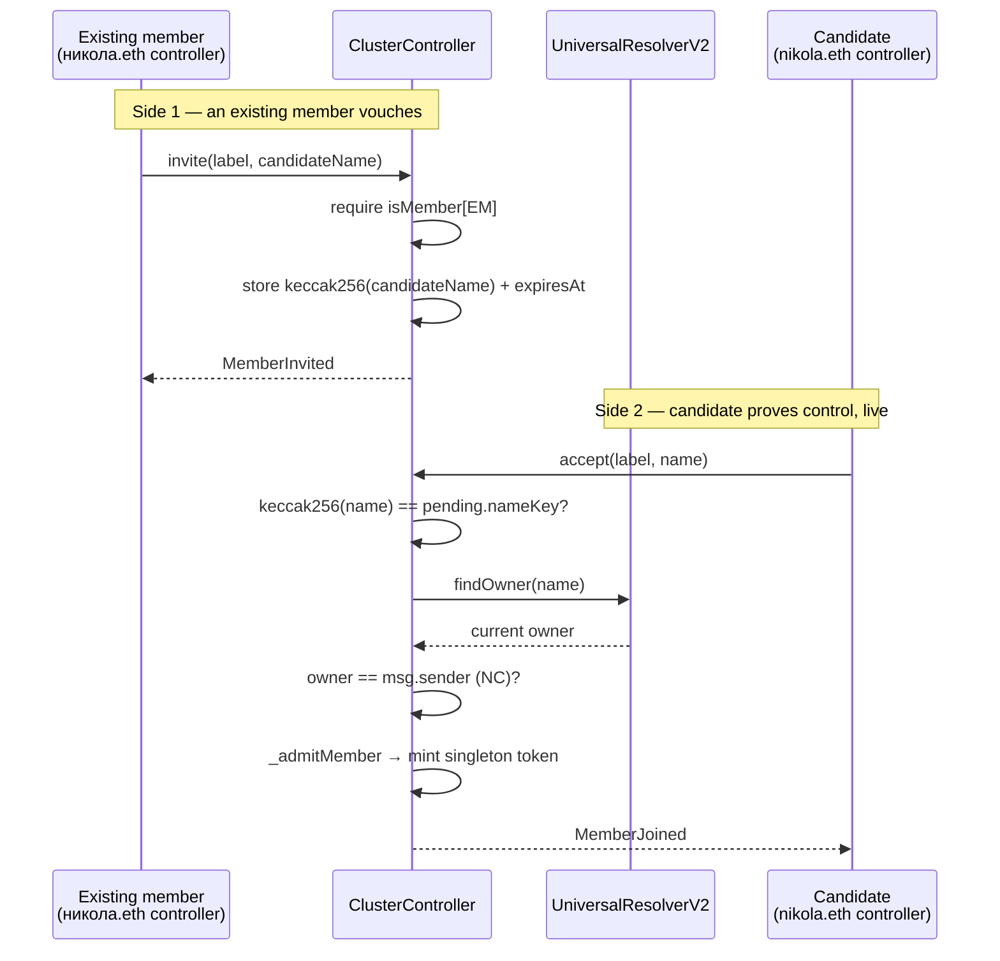
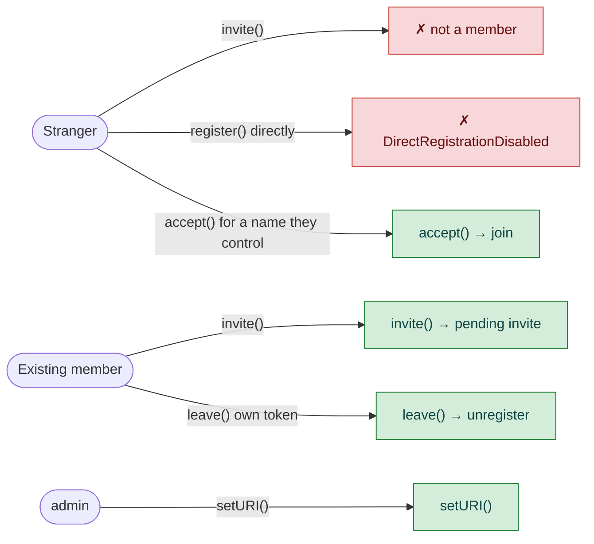

# ENSIP-draft: Cross-Script Identity Linking (`alt-script`)

> **Status of this file:** working draft, not yet opened as a PR against `ensdomains/ensips`.

## Abstract

This ENSIP defines `alt-script`, a global (unprefixed, per ENSIP-5) text record key that lets the
holder of two ENS names assert that they are the same identity, spelled in two different scripts.
The assertion is valid only when both names declare it about each other — comparing by namehash,
never by string — and both resolve to the same nonzero address. No new contract, registry, or
oracle is required: the entire mechanism is two existing `setText` writes plus a client-side read
and comparison.

## Motivation

ENS resolves one name to one address; nothing in the protocol relates two _different_ names to
each other. For a monoscriptal language this is invisible. For a digraphic one — a language
written natively in more than one script, with no single canonical spelling — it splits one
person's identity into as many unrelated ENS nodes as they have spellings.

Serbian is the sharpest example: it is written in both Cyrillic and Latin, both official, and any
one piece of text is in one script or the other, never mixed. `никола.eth` and `nikola.eth` hash
to two completely unrelated nodes — two registrations, two resolvers, two profiles, two histories.
To ENS they are as unrelated as `nikola.eth` and `vitalik.eth`. The same structure recurs for
Kazakh (state-mandated Cyrillic→Latin transition, ~20M people, live now), Mongolian, Uzbek,
Traditional/Simplified Chinese, Japanese kanji/kana, and Serbian/Croatian/Montenegrin Latin
diacritics that ENSIP-15 cannot register at all (`đ`, forcing the ASCII fallback `dj`).

This is not the homograph-spoofing problem that ENSIP-15 already solves by rejecting mixed-script
and whole-script-confusable labels. It is the inverse, and it is _created by_ that correct
rejection: a digraphic user is forced into two separate, valid, unmixed labels, and given no way
to say the two belong together.

**The link cannot be derived, only declared.** Cyrillic→Latin Serbian transliteration is a total
function, but Latin→Cyrillic is not: `nj` is one letter (`њ`) in `konj`/`коњ` and two letters
(`н`+`ј`) in `injekcija`/`инјекција`, and nothing in the string says which. A client cannot compute
the correct twin; only the person who is both can assert it, and only mutual assertion — not a
one-sided claim anyone could forge — makes that assertion trustworthy.

## Specification

### Record key

```
alt-script
```

An unprefixed global key per [ENSIP-5](https://docs.ens.domains/ensip/5/), which reserves bare
lowercase keys for spec-defined globals. (The reference implementation in this repo ships under
the namespaced key `digraphia.alt-script` pending this ENSIP's acceptance, per ENSIP-5's
requirement that application-specific keys be namespaced until a global is standardized.)

### Value

The full ENS name of the counterpart, e.g. `text(namehash("никола.eth"), "alt-script")` →
`"nikola.eth"`.

### Assertion

For two names A and B to be considered linked:

```solidity
setText(namehash(A), "alt-script", B)   // A asserts B is its twin
setText(namehash(B), "alt-script", A)   // B asserts A is its twin, independently
```

### Verification algorithm

A client verifying a claimed link between input strings `inputA` and `inputB` MUST perform, in
order:

1. **Normalize** both inputs under [ENSIP-15](https://docs.ens.domains/ensip/15/). If either
   fails to normalize, the link is invalid.
2. **Compute `namehash`** of each normalized name. If the two nodes are equal, the link is invalid
   (a name cannot be its own twin).
3. **Read `text(node, "alt-script")`** for both names, via a path that performs live resolution
   (e.g. the Universal Resolver, so CCIP-Read / ENSIP-10 wildcard names resolve correctly) rather
   than an indexer or cache.
4. **Compare by namehash, not by string.** For each direction, normalize the value read from the
   record and compute its namehash; the link requires
   `namehash(normalize(text(A))) == namehash(B)` **and** `namehash(normalize(text(B))) == namehash(A)`.
   A raw string comparison MUST NOT be used — it is defeated by an unnormalized or differently
   cased variant that nonetheless hashes to the same node.
5. **Compare `addr()`.** Both names MUST resolve to the same nonzero address. This is what ties
   the two-name assertion to a single controlling identity rather than two cooperating but
   distinct controllers.

The link is valid **iff all five checks pass.** A client MAY additionally report whether the two
names fall in different ENSIP-15 script groups, but MUST NOT treat this as a required check:
ENSIP-15 script groups are coarser than writing systems (Traditional and Simplified Han share the
`Han` group; hiragana and katakana both fall under `Japanese`), so gating on differing groups would
reject same-group cross-script pairs that are otherwise entirely valid.

### Why bidirectionality is the security property

A one-directional record proves nothing: any name's resolver can point a text record at any other
name, including one the writer does not control. What a third party cannot do is make the _other_
name assert the reverse — that requires control of that name's own resolver. Mutual assertion plus
matching `addr()` is therefore sufficient to establish common control without any issuer, oracle,
or on-chain registry of links.

```
A ──asserts──▶ B          proves nothing — anyone can point at anyone
A ◀─asserts──▶ B          requires control of BOTH names
   └── same addr() ──┘    and ties both to one controlling identity
```

## Rationale

**Why a text record and not a new contract.** ENSIP-15 normalization requires Unicode tables, NFC,
emoji-sequence handling and confusables data that cannot run on the EVM. Any on-chain component
can therefore only ever accept precomputed namehashes and can never itself validate that a string
normalizes correctly — so string-level logic must live in a client, and the natural on-chain
counterpart is the resolver primitive ENS already has: `text()`.

**Why the key is global rather than namespaced long-term.** The mechanism is identical regardless
of which two scripts are involved — Cyrillic/Latin, Han/Han, kanji/kana, Gurmukhi/Shahmukhi — so a
language- or script-specific namespace would be actively misleading once used outside its
originating case. A prior draft of the reference implementation used a Serbian-specific namespace
(`rs.dvopis.alt`) and abandoned it for exactly this reason.

**Why the link is not computed, and why the spec makes no attempt to standardize
transliteration.** See Motivation — for Serbian specifically, and for essentially every
digraphic language in general, the Latin→other-script direction is not a function (multiple valid
readings exist and only the speaker's knowledge of morphology picks the right one). Any attempt by
this ENSIP to standardize a transliteration table would be solving the wrong layer: the record
does not encode _how_ to transliterate, only _that_ two specific already-registered names are
asserted, mutually, to be the same identity.

**Why not an N-way (cluster) record in this version.** Some scripts have three or more coexisting
forms for one identity (Traditional Han / Simplified Han / Pinyin; kanji / hiragana / katakana /
rōmaji). An array-valued record generalizing this specification to clusters is a deliberate,
named follow-up (see Backwards Compatibility) rather than part of this proposal, to keep the first
version of this ENSIP small and reviewable against a working reference implementation that only
implements the pairwise case.

## Backwards Compatibility

This ENSIP defines a new text record key and introduces no changes to existing records, resolver
interfaces, or registry behavior. Clients that do not recognize `alt-script` are unaffected; the
record is inert to them, identical to any other text record they don't render.

**Intended future extension (not part of this proposal):** generalizing the pairwise
mutual-assertion check in Specification to N names. A text-record array (a JSON array of every
name in the cluster, generalizing mutual assertion to mutual closure over a declared set) was the
first design considered and is compatible with the scalar form defined here — a client
encountering a scalar value reads it as a one-element cluster. A second, registry-level design —
which avoids the O(n²) closure checks and stale-array risk the array form carries, at the cost of
being a new contract rather than a text record — is sketched in **Appendix A**.

## Security Considerations

**Bidirectionality, not the record's mere presence, is what must be checked.** An implementation
that treats a one-sided `alt-script` record as sufficient evidence of a link is trivially
defeated: anyone can write a text record on a name pointing at any target, including a name they
do not control.

**Namehash comparison, not string comparison.** Comparing raw strings is defeated by an
unnormalized, differently cased, or trailing-dot variant that nonetheless resolves to the same
node as the intended target. All comparisons MUST be by namehash of the normalized value.

**Live reads, not indexed data.** A subgraph or other indexer is push-based and can be stale by
design; a party could set or remove a record moments before or after an indexer's last sync. All
reads that gate a security-relevant decision (e.g. displaying two names as one identity) MUST be
live `eth_call`s through a path that performs correct resolution, not cached or indexed data.

**Offchain resolvers (CCIP-Read / ENSIP-10) shift trust to the gateway operator.** For a name
served by an offchain resolver, both the `text()` and `addr()` values used in verification are
supplied by a gateway that signs its response rather than being read from L1 state directly. This
specification's guarantees hold only as far as that gateway is honest; a compromised or malicious
gateway for either name in a pair can forge both the assertion and the matching address. This is
an inherited property of CCIP-Read generally and not unique to this record, but implementers
displaying a linked identity to end users should be aware that the trust root for an offchain name
is the gateway, not the chain.

**This record makes no claim about which script is "correct" or "canonical."** It asserts mutual
identity between two specific, already-registered names, nothing about the linguistic
relationship between the scripts themselves.

## Appendix A: N-way cluster extension (`ClusterController`, non-normative)

> This appendix is **not part of the ENSIP being proposed above** — it documents the "intended
> future extension" referenced in Backwards Compatibility as a concrete, implementable design, kept
> out of the normative spec so the pairwise proposal stays small and reviewable on its own (per the
> Rationale section "Why not an N-way (cluster) record in this version"). Reference implementation:
> [`contracts/ClusterController.sol`](./contracts/ClusterController.sol). Fuller design-space
> comparison against alternatives (a text-record array, a standalone `LinkRegistry`, a shared
> resolver instance) is in [`ensv2-engineering-options.md`](./ensv2-engineering-options.md).

### A.1 Why a registry, not a bigger text record

Three or more coexisting spellings of one identity (Traditional Han / Simplified Han / Pinyin;
kanji / hiragana / katakana / rōmaji) don't fit the pairwise `A ⟷ B` model in Specification without
either (a) every member carrying a JSON array of every other member — O(n) writes and an O(n²)
mutual-closure check on every read, with no way to detect a member whose array has silently gone
stale — or (b) a structure purpose-built for group membership. ENSv2's registry tree already _is_
that structure: every registry is a singleton-ownership token collection (`ERC1155Singleton` —
exactly one owner per token ID) with membership changes indexable for free via
`LabelRegistered`/`TransferSingle`/`LabelUnregistered` events, which is a guarantee the text-record
form cannot make (its own Security Considerations above require live reads, not indexed data,
precisely because `text()` values fall outside ENSv2's offchain-indexing invariant). A cluster is
therefore represented as one small `PermissionedRegistry` subclass — `ClusterController` — where
each member holds one token in it.

### A.2 System design



Membership is not a new storage shape — it's an ordinary ENSv2 registry token, addressable the same
way any subname is (`<clusterId>.clusters.eth`), enumerable with the same tooling, and reusing the
`Entry` struct and `ERC1155Singleton` machinery `PermissionedRegistry` already provides.

### A.3 User flow: invite → accept (the bidirectional join)

The pairwise spec's security property — one-sided assertion proves nothing, only mutual assertion
does — is preserved by requiring two independent, live-checked calls: an existing member vouches
for a candidate, and the candidate separately proves control of their own name.



Both checks are live at the moment they run — `accept()` never trusts an address `invite()`
supplied earlier, so a name that changes hands between the two calls is judged by its _current_
controller, not a stale snapshot (see `ensv2-engineering-options.md` §1's `resource`-not-`tokenId`
anchoring lesson, applied here to ownership rather than to registry state).

### A.4 Permissions

| Actor                       | Action                            | Gate                                                                                                       |
| --------------------------- | --------------------------------- | ---------------------------------------------------------------------------------------------------------- |
| Founding member             | deploy + auto-join                | constructor requires `findOwner(founderName) == msg.sender`                                                |
| Existing member             | `invite(label, candidateName)`    | `isMember[msg.sender]`                                                                                     |
| Any name controller         | `accept(label, name)`             | invite exists for `label`, not expired, `keccak256(name)` matches, **and** `findOwner(name) == msg.sender` |
| Member (own token only)     | `leave(anyId)`                    | inherited `ROLE_UNREGISTER`, granted _only_ to that member's own token at `accept()` time                  |
| `admin` (constructor param) | `setURI(...)` (inherited)         | `ROLE_SET_URI` — cosmetic/metadata only, no membership authority                                           |
| Anyone                      | `register(...)` (base entrypoint) | always reverts — the only mint path is `invite`+`accept`                                                   |



### A.5 Deliberately unresolved (see contract header for full rationale)

- No multi-member removal ("vote to kick") — only self-service `leave()` exists today.
- No enforcement that a name belongs to at most one cluster.
- No on-chain check that members are actually script-variants of one another — that judgment stays
  off-chain, e.g. via `packages/digraphia/src/verify.ts`, same as the pairwise form above.

## Copyright

Copyright and related rights waived via [CC0](https://creativecommons.org/publicdomain/zero/1.0/).
